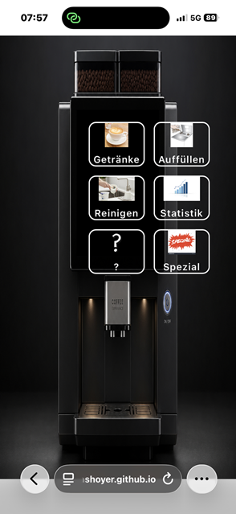
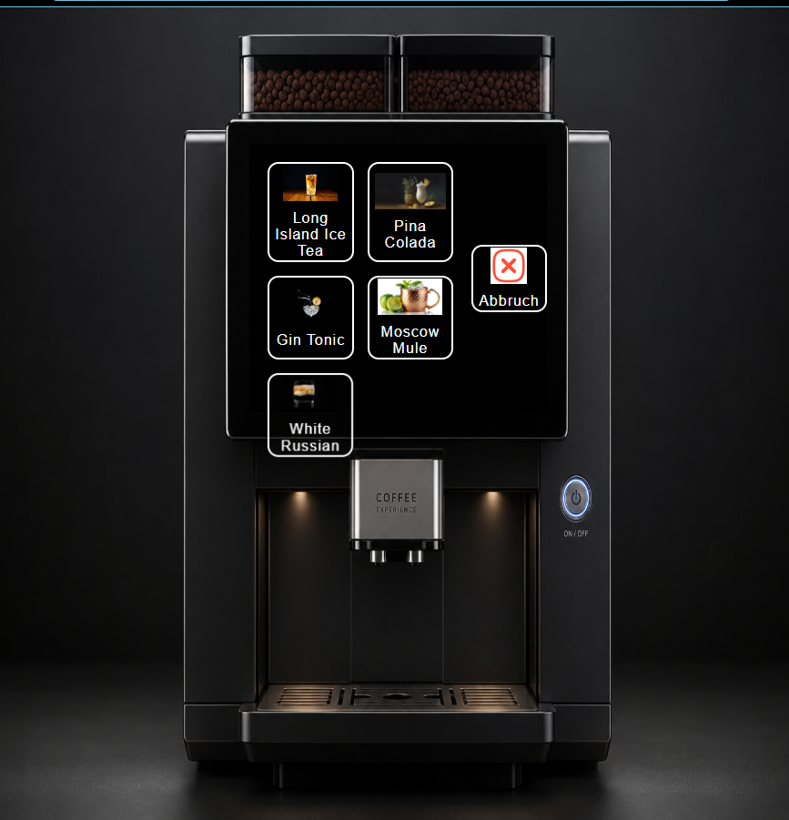
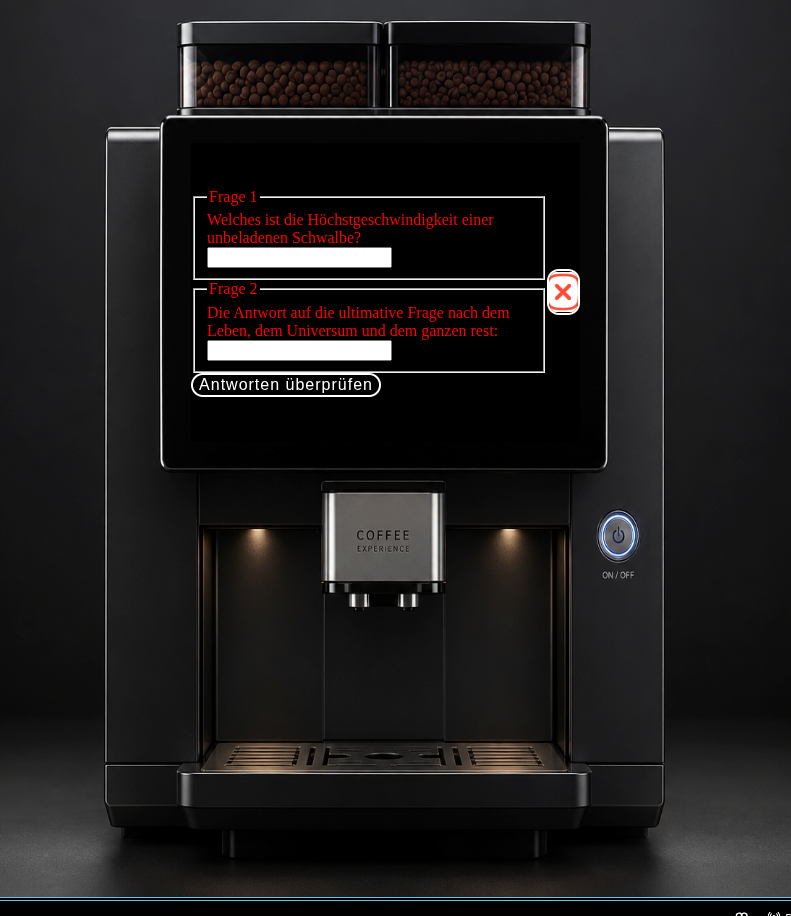

# Dokumentation Barrista88 GUI - Projekt

## Anfängliche Idee und erstes Grundgerüst

Zuerst habe ich mir überlegt wie das Projekt optisch aussehen soll. Ich habe mich dafür entschieden, ein Bild einer Kaffeemaschine welche über ein Display besitzt als Grundlage in meinem HTML - Dokument zu nutzen und auf dieses die Funktionalität mit JavaScript zu legen.

Das Bild ist KI- generiert (ChatGPT): 


Als nächstes habe ich ein HTML Dokument erstellt, mit einem DIV als Container für das Bild und entsprechend die Machine: 

```html

<!DOCTYPE html>
<html lang="en">
<head>
    <meta charset="UTF-8">
    <meta name="viewport" content="width=device-width, initial-scale=1.0">
    <link rel="stylesheet" href="../css/styles.css">
    <script src="../js/barrista88.js" defer></script>
    <title>Barrista88</title>
</head>
<body>
    <div class="maschinencontainer">
        
        
    </div>

</body>
</html>
``` 


Wie man dem Code entnehmen kann, habe ich mich dazu entschlossen, HTML, CSS und JavaScript Code in verschiedenen Dokumenten zu speichern. So wird das Projekt für mich übersichtlicher und lässt sich leichter umgestalten und erweitern.

## Erste Schritte um Funktionalität aufzubauen. 

Um die erste Funktionalität herzustellen, habe ich zwei weitere DIVs in meinem HTML - Dokument erstellt.

Eines, welches als Display/zur Ausgabe meines Codes in dem Dokument dienen soll und eines, welches den An/Aus Schalter der Maschine repräsentiert.
Diese beiden DIVs habe ich in das bereits bestehende DIV untergeordneten und mit entsprechenden IDs versehen:

```html
<div class="maschinencontainer">

    <div id="display">     
    </div>

    <div id="power"></div>

</div>
```
Anschließend habe ich meinen HTML Elementen CSS Attribute zugewiesen. 

```CSS
.maschinencontainer{
    position:relative;
    width:100vw;
    max-width: 100%;
    height:100vh;
    max-height:100%;
    margin:0 auto;
    aspect-ratio: 3 / 2;
}

.kaffeemaschine{
    display:block;
    width: 100%;
    height: 100%;
}

#display{
    border: 2px solid  red;
    position: absolute;
    top: 16.75%;     
    left: 32.5%;   
    width: 35%;   
    height: 33%; 
    background-color: black;
    display:flex;
    justify-content: center;
    align-items: center;
}

#power{
    border: 2px solid red;
    position: absolute;
    top:57%;
    left: 69%;
    width:3.75%;
    height:6%;
    cursor: pointer;
}
```

Das Bild füllt so den ganzen Bildschrim, der Container der Maschine passt sich dem jeweiligen Bildschirm an und durch die absolute Positionierung der anderen DIVs kann ich diese nun genau so positionieren, wie ich es gerne möchte, ohne dass diese die Position verändern, wenn sich die Bildschirmverhltnisse ändern. 
Ich habe bewusst rote Umrandungen für die DIVs aktiviert, um sehen zu können, wo und wie diese in einem Browser dargestellt werden.
Dadurch konnte ich dann die passenden Werte für die Positionierung (top & left) sowie für die Größe (width & height) ermitteln.


_Abbildung: DIVs positionieren und anpassen_


_Abbildung: DIVs sind korrekt positioniert und angepasst_

Als nächstes habe ich in JavaScript eine Variable mit booleschem Wert erstellt, welche den An/Aus Zustand der Maschine darstellen soll:

```JavaScript
let power = false;
```
Der Standardzustand ist "false", die Maschine ist aus.
Dann habe ich 2 Konstanten erstellt, eine für das Display, eine für den Power-Knopf und diese mit den jeweiligen DIVs verknüpft um sie in JavaScript ansprechen zu können.

```JavaScript
const displayElement = document.getElementById("display");
const powerButton = document.getElementById("power");
```
Dann habe ich einen Event Listener mit dem Powerknopf verknüpft, der bei einem Klick den Wert der Variable "power" umdreht. Aus "flase wird "true" und umgekehrt -> aus Aus wird An.
Dazu eine "if" Abfrage die den Power Status checkt und eine entsprechende Meldung im Display ausgibt

```JavaScript
               powerButton.addEventListener ("click", function (){  
                    power = !power;
                    anzeige();
                })
            

            function anzeige(){
                if(power){
                    displayElement.innerText = "Die Maschine ist an.";
                }
                else{
                    displayElement.innerText = "Die Maschine ist aus.";
                }
            }
             
            anzeige();
```
Mithilfe einer CSS-Media-Query fange ich das Hochformat ab und drehe den Inhalt um 90 Grad, um eine querformatige Darstellung zu simulieren. Dadurch wird der Endnutzer dazu bewegt, das Gerät ins Querformat zu drehen oder die Anwendung auf einem geeigneten Gerät zu nutzen


_Abbildung: Erste Funktionalität und Ausgabe im HTML Dokument_

## Erste graphische Darstellung von Zuständen und Menüs

Nun da die erste Funktionalität hergestellt war, wollte ich das ganze natürlich ausarbeiten und verfeinern. Einfache Textausgaben sind doch etwas langweilig, ich wollte schike Menüs, die optisch etwas hermachen und interaktiv sind. 

Meine erste Idee, dies umzusetzen, war, die jeweiligen Menüs in einer anderen HTML Datei zu coden und dann diese Datei in das Display zu laden. 
Das erschein mir sinnvoll und elegant, jede Seite die auf dem Display angezeigt wird, ist eine eigene Seite mit eignem Quellcode auf dem Datenträger.

Ich recherchierte also, wie das umsetzbarr wäre, baute meine hauptmenü.html Seite und habe diese mit folgendem Code in das Display geladen:
```JavaScript
                async function hauptMenü() {
                    const response = await fetch('hauptmenü.html');
                    const html = await response.text();
                    displayElement.innerHTML = html;
                }
```
Die Funktion hat sich die html Datei in eine Konstante geladen (fetch), diese musste aber erst in Text konvertiert werden, um korrekt im Display angezeigt zu werden. 
Dies erfolgt in dem Schritt *"const html = await response.text();*.
Zuguterletzt wurde der html-code in Textform an das Display DIV übergeben, welches das HAuptmenü dann entsprechend gerendert hat. 

Das entsprechende HTML Dokument war aber sher leer, also hatte ich mich dazu entschieden, das entsprechende CSS und ggfs. JS direkt in dem Dokument zu schreiben. 
Das war inkosistent zu meinem ursprünglichen Plan, die jeweilgen Sprachen voneinander zu trennen und mein Code insgesamt war so auch stärker fragmentiert, was Änderungen erschwerte. 
Also habe ich ein wenig Recherche zur "Best Practice" für so ein Projekt betrieben und gelernt, dass man idealerweise alle html Dokumente in diesem Fall in einem einzigen HTML Dokument unterbringt. 
Ich habe also ein weiteres DIV in meinem Display-Container erstellet, welches nun das Hauptmenü enthielt (unterteilt in weitere DIVs, je eines pro Untermenü)
```html
 <div id="display">

            
            
            <div id="hauptmenü">
                <button class="grid-button">
                    
                    Getränke</button>
                <button class="grid-button">
                    
                    Auffüllen</button>
                <button class="grid-button">
                    
                    Reinigen</button>
                <button class="grid-button">
                    
                    Statistik</button>
                <button class="grid-button">
                    
                    ?</button>
                <button class="grid-button">
                    
                    Spezial</button>
            </div> 
        
        </div>
```
Dazu kam ein Bild, welches den "Aus"-Zustand darstellen sollte. 

In CSS habe ich das ganze entsprechend meinen Vorstellungen gestylt:

```CSS
#hauptmenü {
    display: grid;
    grid-template-columns: repeat(2, 1fr);
    grid-template-rows: repeat(3, 1fr);
    gap: 15px; 
    box-sizing: border-box;
    width: 100%;
    height: 100%;
    padding: 20px;
    background-color: black;
  }

  .grid-button {
    background-color: transparent; 
    color: white; 
    border: 2px solid white; 
    border-radius: 12px; 
    font-size: 16px;
    cursor: pointer;
    letter-spacing: 1px; 
    
    display: flex;
    flex-direction: column; 
    align-items: center; 
    justify-content: center; 
    gap: 10px; 
    
    transition: all 0.2s ease; 
  }

  .grid-button:hover {
    background-color: rgba(255, 255, 255, 0.1); 
    transform: scale(1.02); 
  }

  .grid-button img {
    max-height: 40px; 
    width: auto; 
    display: block;
  }
  ```
Ich habe mich für ein Grid - Layout als Grundsatz entschieden, um die einzelnen Buttons entsprechend eines Rasters anordnen zu können. 
Dieses Raster habe ich von einer KI generieren lassen.
Die einztelnen Elemente in dem raster sind flex - Elemnte, sodass sie ihre Größe und Position dynamisch anpassen können können. 
Zu jedem UNtermenü habe ich ein entsprechendes Bild gesucht, welches dieses räpresentiert und in die HTML-Datei eingebunden. 
Den Abschluss machen ein paar nette Effekte, die die jeweiligen Menüs verändern, sobald man mit der Maus darüberfährt.
```CSS
  .grid-button:hover {
    background-color: rgba(255, 255, 255, 0.1); 
    transform: scale(1.02); 
  }
```
Die Hintergrundfarbe verändert sich, sowie die Größe. Dadurch ist dem Nutzer schnell ersichtlich, welche Funktion er auswählt.
Auch habve ich den Mauscursor verändert, sobald er über die einzelnen Menüs und den PowerButton schwebt:
```CSS
cursor: pointer;
```


_Abbildung: Mauscursor_

Dadurch soll dem Nutzer gezeigt werden, welche Flächen interaktiv sind und welche nicht. 

So wie es jetzt ist, wird nun aber alles gleichzeitig im Display angezeigt, was ja nicht sein soll. 
Die Lösung hierfür ist, eine CSS Klasse zu erstellen, welche INhalte ausblendet, und diese dann mit JavaScript an die Elemente zu vergeben, welche je nach Zusatand nicht angezeigt werden sollen: 

```CSS
.versteckt{
    display: none !important;
}
```

```JavaScript

const ausDisplay = document.getElementById("aus");
const anDisplay = document.getElementById("hauptmenü");

            async function anAus(){     //An-Aus Anzeige                                       
                         
                if(power){
                    ausDisplay.classList.add("versteckt");
                    hauptMenü();

                    }
                else if(!power){
                    ausDisplay.classList.remove("versteckt");
                    anDisplay.classList.add("versteckt");
                }
            }            
```
2 Konstanten, die sich wieder die entsprechenden Elemente aus dem html Dokument holen (getElementByID).
Beim Ausführen der abgebildeteten Funktion wird die Klasse dem DOM-Element (das in der Konstante gespeichert ist) zugewiesen, um diese ggfs auszublenden.

Das fertige Resultat sieht dann so aus: 


_Abbildung: Maschine ist aus_

_Abbildung: Die Maschine ist An und zeigt das Hauptmenü_

## Erste Tests und Fehlerbehebung

Ich habe die Webseite zu Testzwecken auf meinem Mobiltelefon geöffnet. Die Darstellung im Hochformat war im Vergleich zm Browser verzerrt: 



Über eine Media Query in CSS fange ich das Hochformat ab und drehe den Inhalt um 90 Grad, um eine querformatige Darstellung zu simulieren und den Endnutzer so dazu zu bewegen, das Gerät zu wenden oder gleich ein anderes zu nutzen.

```CSS

 @media all and (orientation: portrait) {
  body {
    transform: rotate(90deg);
    transform-origin: center center;
    width: 100vh;
    height: 100vw;
    position: absolute;
    top: 50%;
    left: 50%;
    translate: -50% -50%;
  }
}

```
In dem vorherigen Bild ista uch zu erkennen, dass einige der Auswahlelemente nicht in as Display passten und darüber hinaus ragten. Dies war auch in einem späteren Menü im Querformat der Fall:


_Abbildung: Elemente ragen übers Display hinaus_

Mithilfe von KI bin ich dann zu folgender Lösung gekommen:

```CSS
#spezialmenü {
    display: grid;
    grid-template-columns: repeat(3, 1fr);
    grid-template-rows: repeat(2, 1fr);
}
```
Das Menü ist nun 3 Spalten breit und 2 Reihen hoch statt andersherum und: 

```CSS
  .grid-button {
    overflow: hidden;
    min-height: 0;
  }
```

Die einzelnen Elemente haben nun keine Minimalgröße mehr und durch **overflow:hidden; ** wird beim Verändern der Größe in den Elementen alles was üpbersteht abgeschnitten und dadurch verhindert, dass diese über das Elternelement hinausragen.


_Abbildung:Das Menü ist jeztzt neu angeordnet un steht nicht über.


_Abbildung: Auch auf einem kleineren Display im Querformat steht nichts mehr über_

Nun sind auf einem kleineren Display die Elemente nicht kalr zu identifizieren, as zeigt aber auch kalr an, dass diese Anwendung nicht für ein entsprechendes Gerät geeignet ist.
Das Display selbst verschiebt sich zwar, das steht auf meiner Prioritätsliste aber sehr weit unten im Moment.


## Letzte Schritte zu voller Funktionsfähigkeit

Ich habe die Untermenüs in denen eine Auswahl getroffen werden soll ebenso aufgebaut, wie das HAuptmenü und mit passenden Bildern versehen.

ich habe eine Variable angelegt, welche die Nutzerwahl speichert

```JavaScript
let auswahl;
```
Dazu kamen verschieden Konstanten für die einzelnen Elemente
```JavaScript
    const powerButton = document.getElementById("power");
            const ausDisplay = document.getElementById("aus");
            const anDisplay = document.getElementById("hauptmenü");
            const getränkeMenü = document.getElementById("getränkemenü");
            const spezialMenü = document.getElementById("spezialmenü");
```
Dazu jeweil einen Event Listener, welcher auf einen Klick reagiert, und die entsprechende Auswahl in die Variable einträgt
```JavaScript
                //Hauptmenü-knöpfe
                btnGetränke.addEventListener("click", function(){
                    if(!power) return;
                    auswahl="getränke";
                    zeigeMenü();
                });

                btnAuffüllen.addEventListener("click", function(){
                    if(!power) return;
                    auswahl="auffüllen";
                });

                btnReinigen.addEventListener("click", function(){
                    if(!power) return;
                    auswahl="reinigen";
                });

                btnStatistik.addEventListener("click", function(){
                    if(!power) return;
                    auswahl="statistik";
                });

                btnGeheim.addEventListener("click", function(){
                    if(!power) return;
                    auswahl="geheim";
                });

                btnSpezial.addEventListener("click", function(){
                    if(!power)return;
                    auswahl="spezial";
                    zeigeMenü();
                });
```
Sowie eine Funktion, die dann aufgerufen wird, welche dann, je nach Wahl, die entsprechenden Klassen entweder versteckt oder sichtbar macht:

```JavaScript
  function zeigeMenü(){
                    anDisplay.classList.add("versteckt");

                    switch(auswahl){
                        case "getränke":
                            anDisplay.classList.add("versteckt");
                            getränkeMenü.classList.remove("versteckt");
                            btnAbbruch.classList.remove("versteckt");
                            break;
                        case "reinigen":
                            anDisplay.classList.add("versteckt");

                            btnAbbruch.classList.remove("versteckt");
                            break;
                        case "statistik":
                            anDisplay.classList.add("versteckt");

                            btnAbbruch.classList.remove("versteckt");
                            break;
                        case "auffüllen":
                            anDisplay.classList.add("versteckt");

                            btnAbbruch.classList.remove("versteckt");
                            break;
                        case "geheim":
                            anDisplay.classList.add("versteckt");

                            btnAbbruch.classList.remove("versteckt");
                            break;
                        case "spezial":
                            anDisplay.classList.add("versteckt")
                            spezialMenü.classList.remove("versteckt");
                            btnAbbruch.classList.remove("versteckt");
                            break;
                    }
                }
```
Nach diesen Prinzipiedn habe ich alle Menüs aufgebaut und nach und nach Funktionen aus dem vorherigen Projekt übernommen und etwas abgeändert um die Funkton mit der neuen Anwendung zu ermöglichen: 
```JavaScript
  function betriebsstoffePrüfen(auswahl){
                    switch(auswahl){
                        case "Kaffee":
                            if(bohnen >=30 && wasser >=0.4) return true;
                            else return false;
                            break;
                        case "Brühe":
                            if(brühe >= 30 && wasser >= 0.4) return true;
                            else return false;
                            break;
                        case"Kakao":
                            if(milch >= 0.4 && kakao >= 30) return true;
                            else return false;
                        case"Milch":
                            if(milch >= 0.4)return true;
                            else return false;
                    }
                }
``` 
_Beispiel: Funktion zum Prüfen der Betriebsstoffe, jetzt angepasst auf die neue Anwendung_

### Stolpersteine beim Geheimmenü

Um das Geheimmenü zu implementieren, habe ich ein Formular in meinem HTML Dokument erstellt:

```html

            <form class="versteckt"
                   id="geheimmenü"
                   onsubmit="return false;">
                <fieldset>
                <legend>Frage 1</legend>
                <label for="frage1">Welches ist die Höchstgeschwindigkeit einer unbeladenen Schwalbe?</label>
                <input type="text"
                       id="frage1">
                </fieldset>
                
                <fieldset>
                <legend>Frage 2</legend>
                <label for="frage2">Die Antwort auf die ultimative Frage nach dem Leben, dem Universum und dem ganzen rest: </label>
                <input type="text"
                        id="frage2">
                </fieldset>
                <button type="button"
                        id="btnGeheimSenden"
                        class="grid-button">Antworten überprüfen</button>
            </form>
```
Dazu entsprechende Variablen in JavaScript erstellt, sowie einen EventListener mit Funktion, welche die Eingaben prüft:

```JavaScript
const btnGeheimSenden = document.getElementById("btnGeheimSenden");
const frage1Input = document.getElementById("frage1");
const frage2Input = document.getElementById("frage2");

let geheimnis = false;


 //Geheimmenü-Check

                btnGeheimSenden.addEventListener("click", function(){
                    const geheim1 = frage1Input.value.toLowerCase();
                    const geheim2 = frage2Input.value.toLowerCase();

                    if(geheim1.includes("afrikanische") && geheim1.includes("europäische") && geheim1.includes("schwalbe")  && geheim2.includes("42")){
                        geheimnis = true;
                        alert("Das Spezialmenü wurde freigeschaltet");

                        frage1Input.value = "";
                        frage2Input.value = "";
                        geheimMenü.classList.add("versteckt");
                        hauptMenü();
                    }
                    else{
                        fehler +=1;
                        alert("Die Eingabe ist falsch")
                    }
                        if(fehler === 3){
                            alert("WARNUNG: Zu viele Fehler, Menü wird gesperrt!");
                            btnGeheim.classList.add("versteckt");
                            geheimMenü.classList.add("versteckt");
                            hauptMenü();
                        }
                });
```
Hierbei handelt es sich um den voll funktionsfähigen und mehrfach überarbeitetetn Code. 
Mein erster Entwurf beinhaltete einige kleine Fehler und war funktionslos.Rechtschreibfeheler und falsche Variablen, statt **frage1Input.value.toLowerCase();** habe ich ursprünglich nur **frage1Input.toLowerCase();** verwendet, wodurch die Eingabe nicht korrekt abgefragt und umgewandelt wurde. 
Um meinen Code zu korrigieren und die Fehler zu finden, habe ich KI als debugging Hilfe genutzt.
Die KI gab mir den hinweis, mein Formular um das Attribut **onsubmit="return false;** zu erweitern, um so ein erneutes LAden der Seite und somit einen Abbruchd es Scriptes zu verhindern. 

Das fertige Menü ist nun voll funktionsfähig, optisch bin ich aber noch nicht 100% zufriden, die Feinschliffpahse folgt am Ende.


_Abbildung: Fertiges Geheimmenü_

## Testen, Fehlersuche und Finetuning

Nachdem ich alle Menüs erstellt und alle Funktionen eingefübt habe, habe ich getestet, ob das Endergebnis meiner Vorstellung entsprach. 
Dabei sind dann hier un da kleine Fehler aufgekommen, z.B. dass bestimmte Elemente nicht versteckt wurden, wenn die Menüs gewechselt wurden.

Auch ist mir aufgefalen, dass die Fortschrittsanzeigen beim Getränke zubereiten/Reinigen weiterliefen, wenn der An/Aus Schalter betätigt wurden:


_Abbildung: Funktion läuft bei ausgeschalteter Maschine trotzdem weiter_

Die Lösung hierfür war eine einfache if-Abfrage vor dem Ausführend:

```JavaScript
if(!power) return;
```

Dadurch bricht der Vorgang ab, sobald die Maschine "aus" ist.

Ich habe mit der Anwendung herumgespielt und mir den Code angeschaut. Dabei sind mir ein paar Redundanzen aufgefallen, welche ich beseitigt habe, indem ich Code in Funktionen zusammengefasst habe.

So war z.B. zu jedem Event Listener der Elemente es Spezialmenüs folgender Code zugeordnet:

```JavaScript
    alert("Nicht während der Arbeiszeit!");
    hauptMenü();
```
Daraus habe ich dann eine extra Funktion 
```JavaScript
function warnung(){
    alert("Nicht während der Arbeiszeit!");
    hauptMenü();
}
```
 gemacht, welche bei Klick einfach abgerufen wird.
Ein kleiner Stolperstein war hierbei die Übergabe im Event-Listener: Ursprünglich hatte ich 
```JavaScript
btnIceT.addEventListener("click", warnung());
```
geschrieben. Durch die Klammern **"( )"** wurde die Funktion jedoch sofort beim Laden der Seite ausgeführt statt erst beim Klick. Nach dem Entfernen der Klammern  wird die Funktion nun korrekt als Referenz übergeben und erst beim Klick getriggert.

Ich habe zum Abschluss (und periodisch nach Änderungen) meinen Code von der KI analysiern lassen, um mich auf Fehler welche mir entgangen waren hinweisen zu lassen. Auch zu Fragen bezüglich Syntax o-Ä. habe ich diese als Werkzeug hinzugezogen.

## Abschließendes Fazit

Ich habe die Funktionalität so hergestellt, wie ich es mir vorgestellt habe. Allerings hat der gesamte Vorgang länger gedauert, als ursprünglich angenommen.
Ich kam daurch zeitlich etwas in den Verzug, wodurch der letzte Ferinschliff und einige Funktionen, wedlche für mich nebensächlich waren, ausgesetzt wurden.
Gerade im Bereich CSS habe dich doch häufiger recherchieren oder die KI fragen müssen, was den Vorgang verlangsamt hat. 


[?](https://www.youtube.com/watch?v=dQw4w9WgXcQ&list=RDdQw4w9WgXcQ&start_radio=1)

