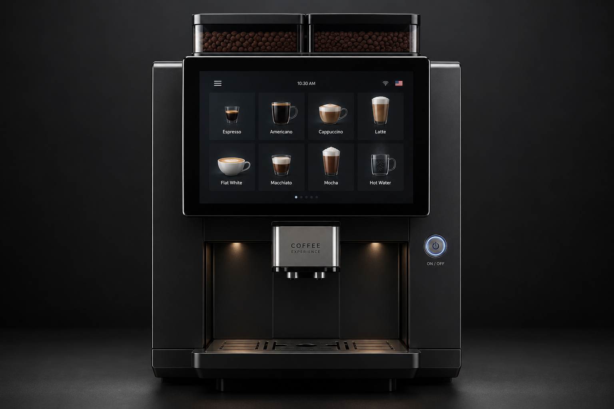
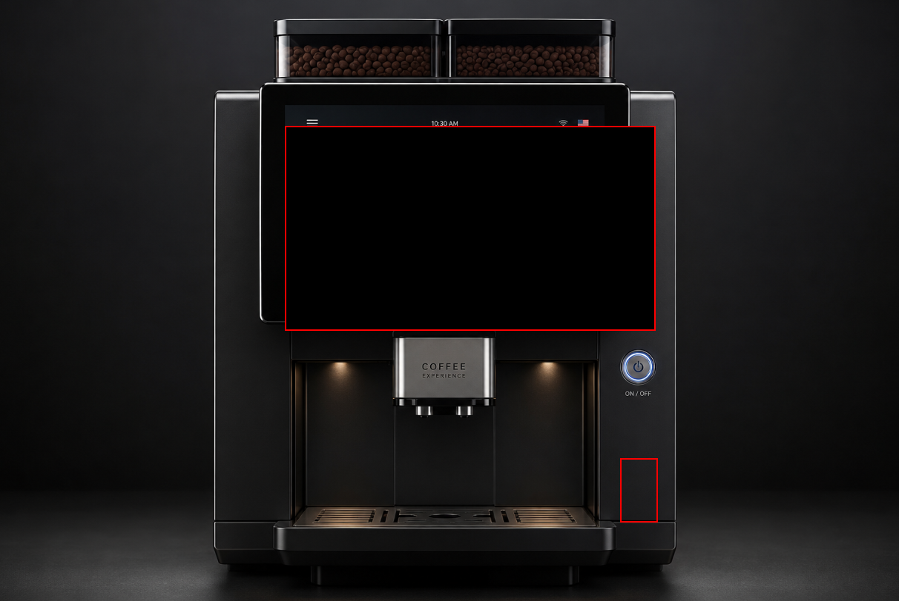
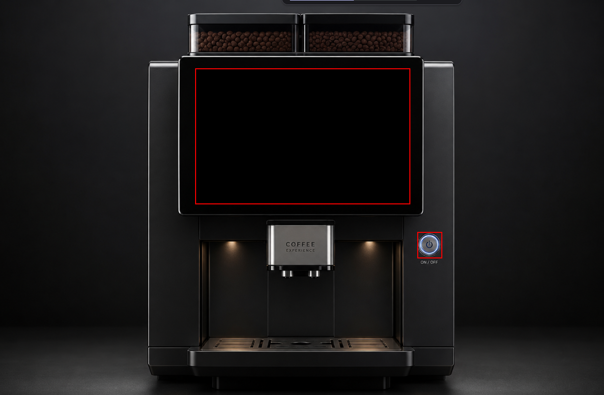
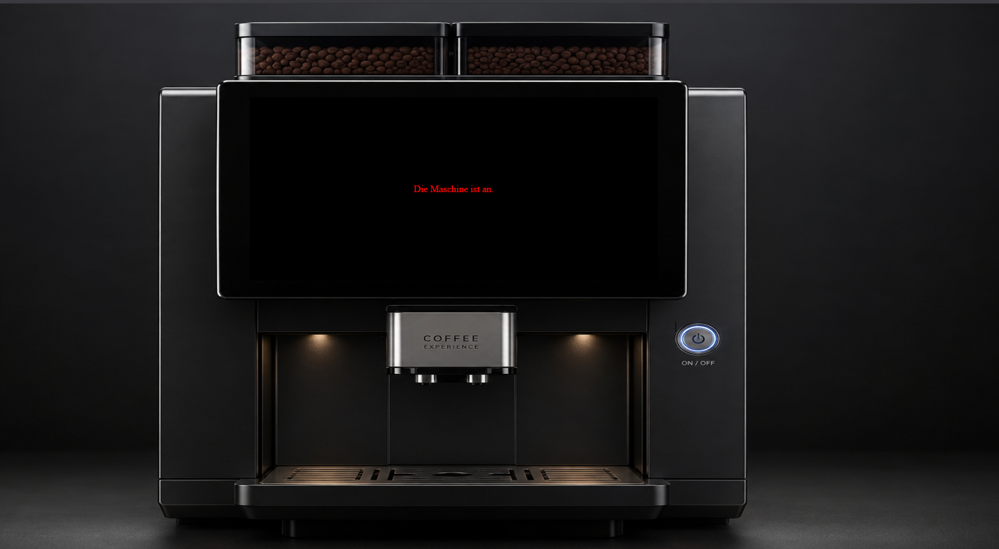
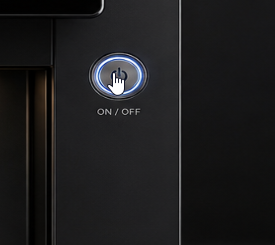
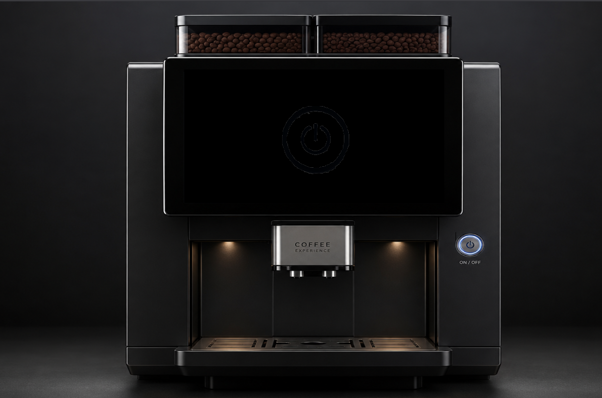
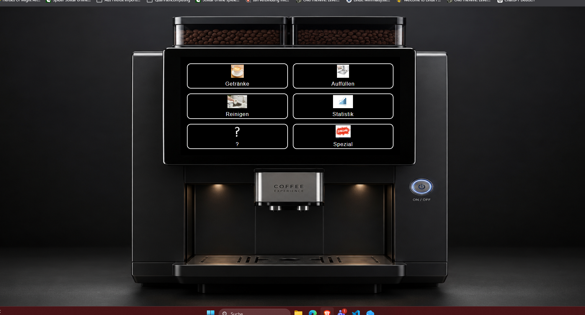

# Dokumentation Barrista88 GUI - Projekt

## Anfängliche Idee und erstes Grundgerüst

Zuerst habe ich mir überlegt wie das Projekt optisch aussehen soll. Ich habe mich dafür entschieden, ein Bild einer Kaffeemaschine welche über ein Display besitzt als Grundlage in meinem HTML - Dokument zu nutzen und auf dieses die Funktionalität mit JavaScript zu legen.

Das Bild ist KI- generiert (ChatGPT): 



Als nächstes habe ich ein HTML Dokument erstellt, mit einem DIV als Container für das Bild und entsprechend die Machine: 

```html

<!DOCTYPE html>
<html lang="en">
<head>
    <meta charset="UTF-8">
    <meta name="viewport" content="width=device-width, initial-scale=1.0">
    <link rel="stylesheet" href="../css/styles.css">
    <script src="../js/barrista88.js" defer></script>
    <title>Barrista88</title>
</head>
<body>
    <div class="maschinencontainer">
        
        
    </div>

</body>
</html>
``` 


Wie man dem Code entnehmen kann, habe ich mich dazu entschlossen, HTML, CSS und JavaScript Code in verschiedenen Dokumenten zu speichern. So wird das Projekt für mich übersichtlicher und lässt sich leichter umgestalten und erweitern.

## Erste Schritte um Funktionalität aufzubauen. 

Um die erste Funktionalität herzustellen, habe ich zwei weitere DIVs in meinem HTML - Dokument erstellt.

Eines, welches als Display/zur Ausgabe meines Codes in dem Dokument dienen soll und eines, welches den An/Aus Schalter der Maschine repräsentiert.
Diese beiden DIVs habe ich in das bereits bestehende DIV untergeordneten und mit entsprechenden IDs versehen:

```html
<div class="maschinencontainer">

    <div id="display">     
    </div>

    <div id="power"></div>

</div>
```
Anschließend habe ich meinen HTML Elementen CSS Attribute zugewiesen. 

```CSS
.maschinencontainer{
    position:relative;
    width:100vw;
    max-width: 100%;
    height:100vh;
    max-height:100%;
    margin:0 auto;
    aspect-ratio: 3 / 2;
}

.kaffeemaschine{
    display:block;
    width: 100%;
    height: 100%;
}

#display{
    border: 2px solid  red;
    position: absolute;
    top: 16.75%;     
    left: 32.5%;   
    width: 35%;   
    height: 33%; 
    background-color: black;
    display:flex;
    justify-content: center;
    align-items: center;
}

#power{
    border: 2px solid red;
    position: absolute;
    top:57%;
    left: 69%;
    width:3.75%;
    height:6%;
    cursor: pointer;
}
```

Das Bild füllt so den ganzen Bildschrim, der Container der Maschine passt sich dem jeweiligen Bildschirm an und durch die absolute Positionierung der anderen DIVs kann ich diese nun genau so positionieren, wie ich es gerne möchte, ohne dass diese die Position verändern, wenn sich die Bildschirmverhltnisse ändern. 
Ich habe bewusst rote Umrandungen für die DIVs aktiviert, um sehen zu können, wo und wie diese in einem Browser dargestellt werden.
Dadurch konnte ich dann die passenden Werte für die Positionierung (top & left) sowie für die Größe (width & height) ermitteln.


_Abbildung: DIVs positionieren und anpassen_


_Abbildung: DIVs sind korrekt positioniert und angepasst_

Als nächstes habe ich in JavaScript eine Variable mit booleschem Wert erstellt, welche den An/Aus Zustand der Maschine darstellen soll:

```JavaScript
let power = false;
```
Der Standardzustand ist "false", die Maschine ist aus.
Dann habe ich 2 Konstanten erstellt, eine für das Display, eine für den Power-Knopf und diese mit den jeweiligen DIVs verknüpft um sie in JavaScript ansprechen zu können.

```JavaScript
const displayElement = document.getElementById("display");
const powerButton = document.getElementById("power");
```
Dann habe ich einen Event Listener mit dem Powerknopf verknüpft, der bei einem Klick den Wert der Variable "power" umdreht. Aus "flase wird "true" und umgekehrt -> aus Aus wird An.
Dazu eine "if" Abfrage die den Power Status checkt und eine entsprechende Meldung im Display ausgibt

```JavaScript
               powerButton.addEventListener ("click", function (){  
                    power = !power;
                    anzeige();
                })
            

            function anzeige(){
                if(power){
                    displayElement.innerText = "Die Maschine ist an.";
                }
                else{
                    displayElement.innerText = "Die Maschine ist aus.";
                }
            }
             
            anzeige();
```
 Mithilfe von CSS habe ich zum Einen die Rahmen auskommentiert und zum Anderen den Text im Display dann rot anzeigen lassen. Ich habe überprüft, ob die einfache Funktionalität des An- und Ausschaltens gegeben war. 
Dabei hat sich zuerst nichts getan, da in meinem ersten Versuch der Klick auf den Power-Knopf die Anzeigefunktion nicht nochmal wieder aufgerufen hat. Oben ist bereits der korrigierte Code zu lesen, der über volle Funktionalität verfügt.


_Abbildung: Erste Funktionalität und Ausgabe im HTML Dokument_

## Erste graphische Darstellung von Zuständen und Menüs

Nun da die erste Funktionalität hergestellt war, wollte ich das ganze natürlich ausarbeiten und verfeinern. Einfache Textausgaben sind doch etwas langweilig, ich wollte schike Menüs, die optisch etwas hermachen und interaktiv sind. 

Meine erste Idee, dies umzusetzen, war, die jeweiligen Menüs in einer anderen HTML Datei zu coden und dann diese Datei in das Display zu laden. 
Das erschein mir sinnvoll und elegant, jede Seite die auf dem Display angezeigt wird, ist eine eigene Seite mit eignem Quellcode auf dem Datenträger.

Ich recherchierte also, wie das umsetzbarr wäre, baute meine hauptmenü.html Seite und habe diese mit folgendem Code in das Display geladen:
```JavaScript
                async function hauptMenü() {
                    const response = await fetch('hauptmenü.html');
                    const html = await response.text();
                    displayElement.innerHTML = html;
                }
```
Die Funktion hat sich die html Datei in eine Konstante geladen (fetch), diese musste aber erst in Text konvertiert werden, um korrekt im Display angezeigt zu werden. 
Dies erfolgt in dem Schritt *"const html = await response.text();*.
Zuguterletzt wurde der html-code in Textform an das Display DIV übergeben, welches das HAuptmenü dann entsprechend gerendert hat. 

Das entsprechende HTML Dokument war aber sher leer, also hatte ich mich dazu entschieden, das entsprechende CSS und ggfs. JS direkt in dem Dokument zu schreiben. 
Das war inkosistent zu meinem ursprünglichen Plan, die jeweilgen Sprachen voneinander zu trennen und mein Code insgesamt war so auch stärker fragmentiert, was Änderungen erschwerte. 
Also habe ich ein wenig Recherche zur "Best Practice" für so ein Projekt betrieben und gelernt, dass man idealerweise alle html Dokumente in diesem Fall in einem einzigen HTML Dokument unterbringt. 
Ich habe also ein weiteres DIV in meinem Display-Container erstellet, welches nun das Hauptmenü enthielt (unterteilt in weitere DIVs, je eines pro Untermenü)
```html
 <div id="display">

            
            
            <div id="hauptmenü">
                <button class="grid-button">
                    
                    Getränke</button>
                <button class="grid-button">
                    
                    Auffüllen</button>
                <button class="grid-button">
                    
                    Reinigen</button>
                <button class="grid-button">
                    
                    Statistik</button>
                <button class="grid-button">
                    
                    ?</button>
                <button class="grid-button">
                    
                    Spezial</button>
            </div> 
        
        </div>
```
Dazu kam ein Bild, welches den "Aus"-Zustand darsteöllen sollte. 

In CSS habe ich das ganze entsprechend meinen Vorstellungen gestylt:
```CSS
#hauptmenü {
    display: grid;
    grid-template-columns: repeat(2, 1fr);
    grid-template-rows: repeat(3, 1fr);
    gap: 15px; 
    box-sizing: border-box;
    width: 100%;
    height: 100%;
    padding: 20px;
    background-color: black;
  }

  .grid-button {
    background-color: transparent; 
    color: white; 
    border: 2px solid white; 
    border-radius: 12px; 
    font-size: 16px;
    cursor: pointer;
    letter-spacing: 1px; 
    
    display: flex;
    flex-direction: column; 
    align-items: center; 
    justify-content: center; 
    gap: 10px; 
    
    transition: all 0.2s ease; 
  }

  .grid-button:hover {
    background-color: rgba(255, 255, 255, 0.1); 
    transform: scale(1.02); 
  }

  .grid-button img {
    max-height: 40px; 
    width: auto; 
    display: block;
  }
  ```
Ich habe mich für ein Grid - Layout als Grundsatz entschieden, um die einzelnen Buttons entsprechend eines Rasters anordnen zu können. 
Dieses Raster habe ich von einer KI generieren lassen.
Die einztelnen Elemente in dem raster sind flex - Elemnte, sodass sie ihre Größe und Position dynamisch anpassen können können. 
Zu jedem UNtermenü habe ich ein entsprechendes Bild gesucht, welches dieses räpresentiert und in die HTML-Datei eingebunden. 
Den Abschluss machen ein paar nette Effekte, die die jeweiligen Menüs verändern, sobald man mit der Maus darüberfährt.
```CSS
  .grid-button:hover {
    background-color: rgba(255, 255, 255, 0.1); 
    transform: scale(1.02); 
  }
```
Die Hintergrundfarbe verändert sich, sowie die Größe. Dadurch ist dem Nutzer schnell ersichtlich, welche Funktion er auswählt.
Auch habve ich den Mauscursor verändert, sobald er über die einzelnen Menüs und den PowerButton schwebt:
```CSS
cursor: pointer;
```


_Abbildung: Mauscursor_

Dadurch soll dem Nutzer gezeigt werden, welche Flächen interaktiv sind und welche nicht. 

So wie es jetzt ist, wird nun aber alles gleichzeitig im Display angezeigt, was ja nicht sein soll. 
Die Lösung hierfür ist, eine CSS Klasse zu erstellen, welche INhalte ausblendet, und diese dann mit JavaScript an die Elemente zu vergeben, welche je nach Zusatand nicht angezeigt werden sollen: 

```CSS
.versteckt{
    display: none !important;
}
```

```JavaScript

const ausDisplay = document.getElementById("aus");
const anDisplay = document.getElementById("hauptmenü");

            async function anAus(){     //An-Aus Anzeige                                       
                         
                if(power){
                    ausDisplay.classList.add("versteckt");
                    hauptMenü();

                    }
                else if(!power){
                    ausDisplay.classList.remove("versteckt");
                    anDisplay.classList.add("versteckt");
                }
            }            
```
2 Konstanten, die sich wieder die entsprechenden Elemente aus dem html Dokument holen (getElementByID).
Beim Ausführen der abgebildeteten Funktion wird die Klasse dem DOM-Element (das in der Konstante gespeichert ist) zugewiesen, um diese ggfs auszublenden.

Das fertige Resultat sieht dann so aus: 


_Abbildung: Maschine ist aus_

_Abbildung: Die Maschine ist An und zeigt das Hauptmenü_


